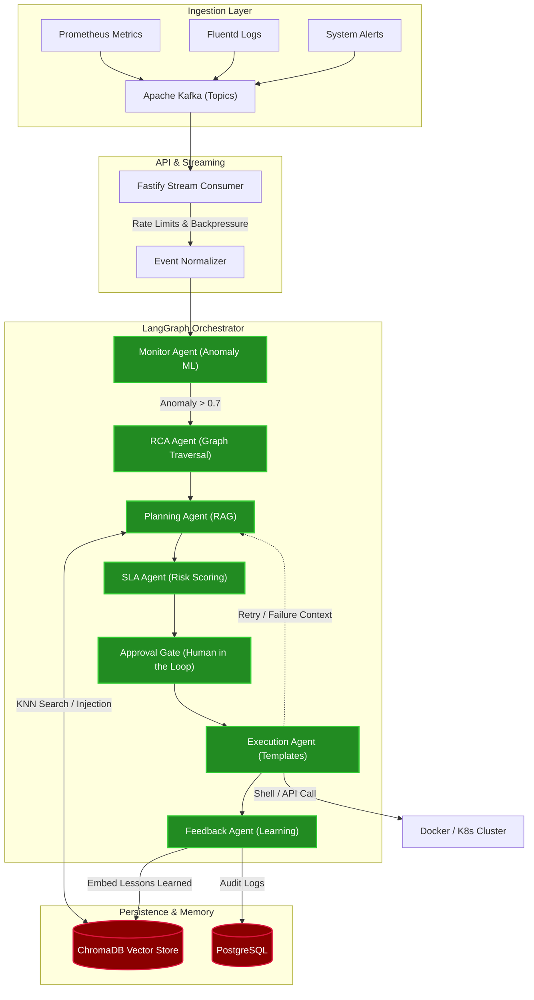
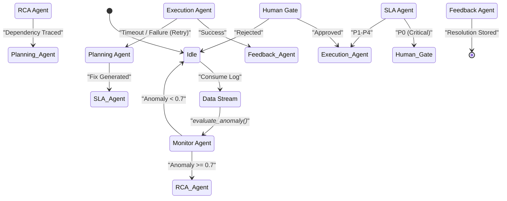
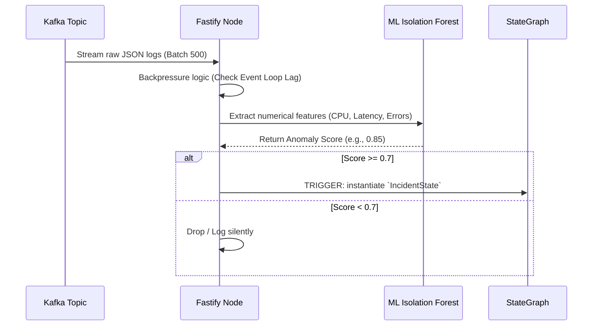
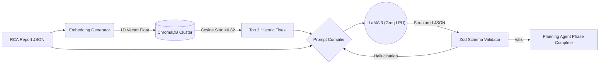
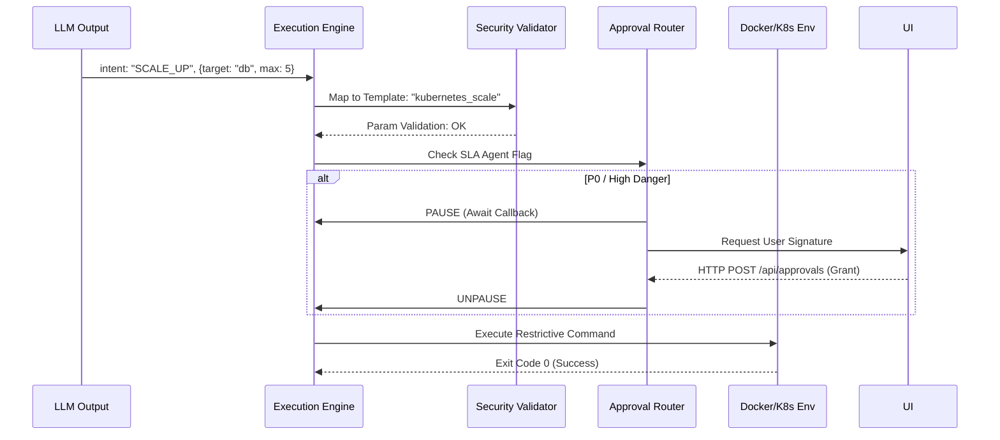

# ⚙️ AutoOps AI — Deep Technical Implementation & Flow Guide

> **Target Audience:** Engineering Leadership, Principal SREs, System Architects, and Code Reviewers.
> 
> *This document provides an exhaustive, code-level breakdown of the mathematical models, software engineering patterns, and execution flow of the AutoOps AI agent framework. It maps exactly **how** data moves and changes state throughout the system.*

---

## 1. High-Level System Architecture

At its core, AutoOps AI is an event-driven, multi-agent orchestration engine. We chose a microservice-like internal structure coordinated by an immutable Redux-like state graph, avoiding the brittle nature of traditional sequential runbooks.

---

## 2. The Agentic State Machine (LangGraph Orchestrator)

Unlike simple LangChain sequences which are DAGs (Directed Acyclic Graphs), an infrastructure outage resolution requires cyclical flows (e.g., trying a fix, failing, going back to plan a new fix). 

### How State Mutates
Every incident initialized by the orchestrator creates an instance of `IncidentState`. Agents execute asynchronously, pulling context from `IncidentState`. However, agents **cannot mutate** the global state directly. They return a *State Patch* which the orchestrator strictly merges. This guarantees thread safety and an immutable audit trail.

---

## 3. Ingestion & Anomaly Detection Flow

### The Mathematics Behind Detection
If we relied on hardcoded thresholds (e.g., `Memory > 90%`), the system would suffer from alert fatigue because normal traffic spikes trigger false alarms.

1. **Ingestion Buffer:** Kafka streams push to the Fastify consumer. To prevent an event loop crash under heavy traffic, events are buffered in memory blocks.
2. **Feature Extraction:** Non-numerical logs are vectorized structurally. The time delta from the last spike is calculated.
3. **Isolation Forest Model:** 
    - The ML engine evaluates new events in real-time against an active tree. 
    - *Calculation:* The fewer nodes an event must pass through to be "isolated" from normal traffic clusters, the more anomalous it is.
4. **Temporal Decay Tracking:** The isolation score is combined with a time-decay weight $W = e^{-\lambda t}$. This deduplicates rapid error spams (preventing 10 alerts for the same repeating error).

---

## 4. Problem Solving Flow: RAG Query & Planning

Once the Root Cause tracking is finished, the **Planning Agent** leverages ChromaDB (Retrieval-Augmented Generation) and Groq LLaMA 3 70B for zero-latency semantic reasoning.

### The RAG Mechanism Steps:
1. **Stringification:** The RCA agent outputs a JSON report. This report is stringified into a narrative text block (`"Service A crashed due to downstream timeout scaling from DB connection limit..."`).
2. **Embedding:** We utilize local or embedded models to convert this narrative into a 1536-dimensional vector float array.
3. **ChromaDB K-NN:** The array is cross-referenced using Cosine Similarity against all past incidents.
4. **Prompt Building:** 
    - *System Prompt:* "You are a senior DevOps engineer."
    - *Context Window:* Pre-loads the top 3 resolutions that previously solved similar mathematical embeddings.
    - *Current Outage:* Appends the current live data.
5. **Deterministic Schema:** The Groq API is forced to respond only in a structured `Zod` output format (strictly enforcing `Array<FixStep>`).

---

## 5. Safely Executing Fixes (The Constraint Flow)

Allowing an AI execution engine uncontrolled root terminal access is an enterprise disaster waiting to happen. AutoOps prevents chaos utilizing a **Template-Based Fix Engine**.

### How safe execution is guaranteed:
Instead of generating generic bash commands (`#!/bin/bash sudo rm ...`), the LLM only suggests an intent and specifies template parameters.

1. **Semantic Match:** LLM recommends `intent: "RESTART_POD", target: "auth-service"`.
2. **Template Expansion:** The execution engine maps this to an internal, highly audited constant string: `kubectl rollout restart deployment/{{target}} -n production`.
3. **Regex Validator:** The parameters pass a strict validator checking for command injection (e.g., ensuring `target` doesn't contain `; rm -rf /`).
4. **SLA Gating Check:** If the SLA agent flagged this as a critical path, the execution pauses and sends a WebSocket payload to the Front-End Dashboard. An Admin must click "Approve" (calling the Fastify `approvals.router.ts`), unblocking the StateGraph promise.
5. **Node.js Spawn/Exec:** The `child_process.exec` physically patches the environment.

---

## 6. Feedback Loop (Continuous Maturation)

The final agent in the StateGraph is the **Feedback Agent**.
It evaluates the success of the execution (did latency drop? Did errors stop?).

If the execution succeeded:
- The exact state graph inputs, vectors, and execution logs are fed back into ChromaDB.
- This creates semantic density. The next time a similar incident arises, the vectors will cluster more tightly, granting higher confidence to the prompt injection.
- Over time, MTTR (Mean Time To Recovery) approaches $T_{execution}$, as the planning phase converges instantly onto historic truth.
