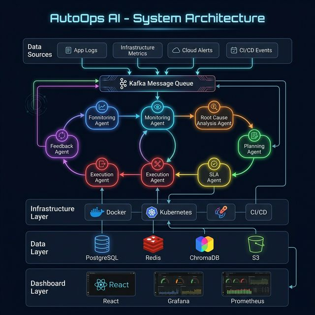
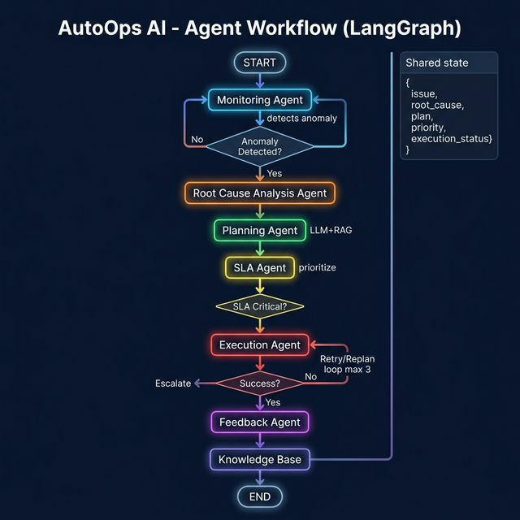
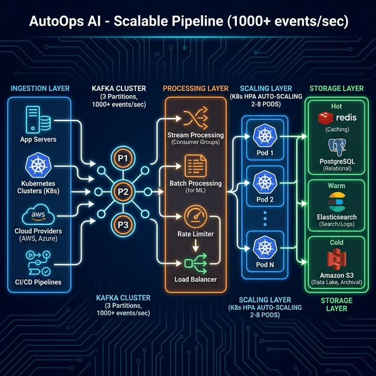

# 🏗️ AutoOps AI — Architecture Diagrams

> **Visual reference for system architecture and data flow**

---

## 1. System Architecture Diagram



```
┌───────────────────────────────────────────────────────────────────┐
│                    AutoOps AI — System Architecture                │
├───────────────────────────────────────────────────────────────────┤
│                                                                   │
│  ┌─────────────────────── DATA SOURCES ──────────────────────┐   │
│  │  App Logs  │  Infra Metrics  │  K8s Events  │  CI/CD      │   │
│  └──────────────────────┬────────────────────────────────────┘   │
│                         │                                        │
│                         ▼                                        │
│  ┌─────────────── KAFKA MESSAGE QUEUE ───────────────────────┐   │
│  │  raw-events (×12)  │  processed  │  results  │  commands  │   │
│  └──────────────────────┬────────────────────────────────────┘   │
│                         │                                        │
│  ┌──────────── AGENT PROCESSING LAYER ───────────────────────┐   │
│  │                                                            │   │
│  │   ┌──────┐   ┌──────┐   ┌──────┐   ┌──────┐   ┌──────┐  │   │
│  │   │ MON  │──→│ RCA  │──→│ PLAN │──→│ SLA  │──→│ EXEC │  │   │
│  │   │ 🔍   │   │ 🔎   │   │ 🧠   │   │ ⏰   │   │ ⚙️   │  │   │
│  │   └──────┘   └──────┘   └──────┘   └──────┘   └──┬───┘  │   │
│  │       ↑                                           │       │   │
│  │       └─────────── FEEDBACK 📊 ←──────────────────┘       │   │
│  │                                                            │   │
│  └────────────────────────────────────────────────────────────┘   │
│                         │                                        │
│  ┌──────────────── DATA LAYER ───────────────────────────────┐   │
│  │  PostgreSQL     │    ChromaDB      │    Redis (optional)  │   │
│  │  (incidents)    │    (RAG vectors) │    (cache)           │   │
│  └───────────────────────────────────────────────────────────┘   │
│                                                                   │
│  ┌──────────── INFRASTRUCTURE LAYER ─────────────────────────┐   │
│  │  Docker  │  Kubernetes  │  GitHub Actions  │  Terraform   │   │
│  └───────────────────────────────────────────────────────────┘   │
└───────────────────────────────────────────────────────────────────┘
```

---

## 2. Agent Workflow Diagram



```
                    ┌─────────┐
                    │  START  │
                    └────┬────┘
                         │
                    ┌────▼────┐
                    │ Monitor │ Detects anomaly
                    │  Agent  │
                    └────┬────┘
                         │
                    ◇ Anomaly? ◇
                   ╱              ╲
                 No               Yes
                 │                 │
              (loop)          ┌────▼────┐
                              │  RCA    │ Identifies root cause
                              │  Agent  │
                              └────┬────┘
                                   │
                              ┌────▼────┐
                         ┌───→│Planning │ Generates remediation plan
                         │    │  Agent  │ (Groq LLM + RAG)
                         │    └────┬────┘
                         │         │
                         │    ┌────▼────┐
                         │    │  SLA    │ Assigns priority
                         │    │  Agent  │
                         │    └────┬────┘
                         │         │
                         │    ◇ Fast Track? ◇
                         │   ╱              ╲
                         │  No              Yes
                         │   │               │
                         │   │    (preempt)   │
                         │   └───────┬───────┘
                         │           │
                         │    ┌──────▼──────┐
                         │    │  Execution  │ Runs fix actions
                         │    │   Agent     │
                         │    └──────┬──────┘
                         │           │
                         │    ◇ Success? ◇
                         │   ╱     │      ╲
                         │  No     │      Yes
                         │  │      │       │
                         │  │  (retries    │
                 replan  │  │   > 3?)  ┌───▼────┐
                 ┌───────┘  │      │   │Feedback│ Store & learn
                 │          │      │   │ Agent  │
                 │   ┌──────▼──┐   │   └───┬────┘
                 └───│ Replan  │   │       │
                     └─────────┘   │  ┌────▼────┐
                                   │  │   END   │
                          ┌────────▼┐ └─────────┘
                          │ESCALATE │
                          │(human)  │
                          └─────────┘
```

---

## 3. Scalable Pipeline Diagram



```
┌─ INGESTION ─┐    ┌── PROCESSING ──┐    ┌── SCALING ──┐    ┌─ STORAGE ─┐
│             │    │                │    │             │    │           │
│ App Servers │    │ Stream Proc.   │    │ K8s HPA     │    │ 🔴 Hot    │
│ K8s Clusters│──→│  Consumer Grps │──→│  Auto-scale │──→│ Redis+PG  │
│ Cloud Svcs  │    │                │    │  2→8 pods   │    │           │
│ CI/CD Tools │    │ Batch Proc.    │    │             │    │ 🟡 Warm   │
│             │    │  ML Training   │    │ Load        │    │ PG+Search │
│  1000+      │    │                │    │ Balancer    │    │           │
│  events/sec │    │ Rate Limiter   │    │             │    │ 🔵 Cold   │
│             │    │ Backpressure   │    │             │    │ S3/Object │
└─────────────┘    └────────────────┘    └─────────────┘    └───────────┘
```

---

## 4. Data Flow Diagram

```
┌──────────┐     ┌──────────┐     ┌──────────┐     ┌──────────┐
│  Input   │     │  Process │     │  Decide  │     │  Output  │
│          │     │          │     │          │     │          │
│ Raw logs │────→│ Feature  │────→│ Anomaly  │────→│ Issue    │
│ Metrics  │     │ Extract  │     │ Detect   │     │ Created  │
│ Alerts   │     │ Normalize│     │ Score    │     │ Alert    │
└──────────┘     └──────────┘     └──────────┘     └──────────┘
                                       │
                                       ▼
                                 ┌──────────┐
                                 │Dependency│
                                 │ Graph +  │
                                 │ Rules    │
                                 └────┬─────┘
                                      │
                      ┌───────────────┼───────────────┐
                      ▼               ▼               ▼
                ┌──────────┐   ┌──────────┐   ┌──────────┐
                │ RAG      │   │ LLM Plan │   │ Priority │
                │ Retrieve │──→│ Generate │──→│ Assign   │
                │ (Chroma) │   │ (Groq)   │   │ (SLA)    │
                └──────────┘   └──────────┘   └──────────┘
                                                    │
                                                    ▼
                                              ┌──────────┐
                                              │ Execute  │
                                              │ Actions  │
                                              └────┬─────┘
                                                   │
                                              ┌────▼─────┐
                                              │ Feedback │
                                              │ & Learn  │
                                              └──────────┘
```
